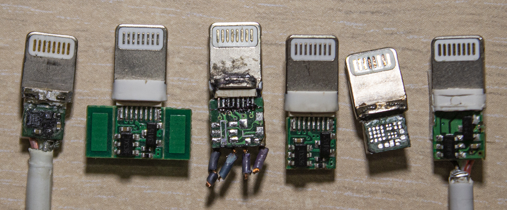
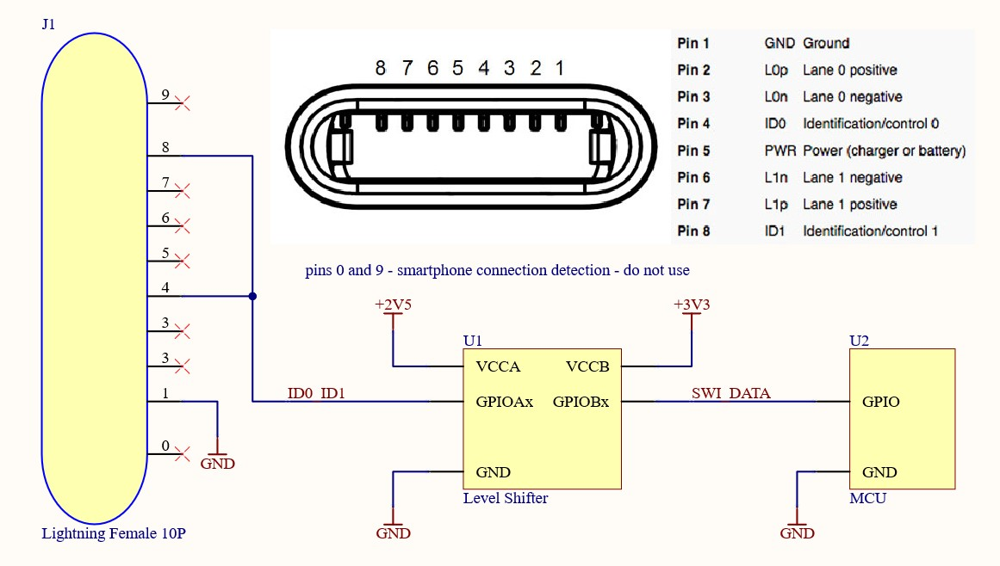

# SWI Library


## Содержание
* [Описание](#описание)
* [Поддерживаемые платы](#поддерживаемые-платы)
* [API](#api)
* [Установка](#установка)
* [Подключение аксессуара](#подключение-аксессуара)
* [Ссылки](#ссылки)

## Описание
* Библиотека для [Arduino IDE](https://www.arduino.cc/en/software), сделана в виде класса. Позволяет получить информацию из аксессуара с разъемом Lightning. Подобный функционал реализует [iCopy](https://youtu.be/0udk8As7xwQ)
* Протокол реализован программно (софтверно), использует несколько стандартных [функций Arduino IDE](https://www.arduino.cc/reference/en/).
```C++
pinMode();
digitalRead();
digitalWrite();
delayMicroseconds();
```
* Для наблюдения за сигналами можно использовать мою версию декодер [SWI-Protocol-Decoder](https://github.com/S-LABc/SWI-Protocol-Decoder).
* **Необходимо** использовать согласователь уровней, например [TXS0108E](https://www.ti.com/lit/ds/symlink/txs0108e.pdf)(HW-221) или подобный, иначе **спалите контроллер аксессуара!**
* Есть подсчет контрольной суммы CRC8 принятых данных.

## Поддерживаемые платы
* Список плат и ядер, с которыми работает библиотека. *Проверен мной лично*. **Не забывайте про согласование уровней!**

| Плата | Ядро | Согласователь |
| :----: | :-------: | :-------: |
| STM32F103C8T6 | [Arduino_STM32](https://github.com/rogerclarkmelbourne/Arduino_STM32) | [TXS0108E](https://www.ti.com/lit/ds/symlink/txs0108e.pdf) |
| STM32F103C8T6 | [Arduino_Core_STM32](https://github.com/stm32duino/Arduino_Core_STM32) | [TXS0108E](https://www.ti.com/lit/ds/symlink/txs0108e.pdf) |
| STM32F401CCU6 | [Arduino_STM32](https://github.com/rogerclarkmelbourne/Arduino_STM32) | [TXS0108E](https://www.ti.com/lit/ds/symlink/txs0108e.pdf) |
| STM32F401CCU6 | [Arduino_Core_STM32](https://github.com/stm32duino/Arduino_Core_STM32) | [TXS0108E](https://www.ti.com/lit/ds/symlink/txs0108e.pdf) |
| STM32F411CEU6 | [Arduino_STM32](https://github.com/rogerclarkmelbourne/Arduino_STM32) | [TXS0108E](https://www.ti.com/lit/ds/symlink/txs0108e.pdf) |
| STM32F411CEU6 | [Arduino_Core_STM32](https://github.com/stm32duino/Arduino_Core_STM32) | [TXS0108E](https://www.ti.com/lit/ds/symlink/txs0108e.pdf) |
| STM32_F4VE | [Arduino_Core_STM32](https://github.com/stm32duino/Arduino_Core_STM32) | [TXS0108E](https://www.ti.com/lit/ds/symlink/txs0108e.pdf) |
| ESP8266 WeMos D1 Mini | [Arduino ESP8266](https://github.com/esp8266/Arduino) | [TXS0108E](https://www.ti.com/lit/ds/symlink/txs0108e.pdf) |
| ESP8266 WeMos D1 R2 | [Arduino ESP8266](https://github.com/esp8266/Arduino) | [TXS0108E](https://www.ti.com/lit/ds/symlink/txs0108e.pdf) |
| ESP32 Devkit V4 | [arduino-esp32](https://github.com/espressif/arduino-esp32) | [TXS0108E](https://www.ti.com/lit/ds/symlink/txs0108e.pdf) |
| Arduino Nano | Встроенное | [TXS0108E](https://www.ti.com/lit/ds/symlink/txs0108e.pdf) |
| Arduino Uno | Встроенное | [TXS0108E](https://www.ti.com/lit/ds/symlink/txs0108e.pdf) |
| Arduino Leonardo R3 | Встроенное | [TXS0108E](https://www.ti.com/lit/ds/symlink/txs0108e.pdf) |
| Arduino Pro Micro | Встроенное | [TXS0108E](https://www.ti.com/lit/ds/symlink/txs0108e.pdf) |
| Arduino Pro Mini | Встроенное | [TXS0108E](https://www.ti.com/lit/ds/symlink/txs0108e.pdf) |

## API

### Инициализация
* Создать объект с именем (в данном случае SWI), указав вывод микроконтроллера к которому подключен контакт **ID0** или **ID1** (он же **ID_BUS**, он же **ACC_ID**).
```C++
SWI SWI (uint8_t pin);
```

### Доступные методы
* Проверить соединение с чипом в аксессуаре. *Запрашивает CHIP_ID и проверяет первый байт на значение 0x75*. Костыль, но работает.
```C++
bool isLightningConnected(void);
```
* Запрос значений **ChipID** побайтово. Допустимые *num_byte* от 1 до 6.
```C++
byte getLightningChipID(uint8_t num_byte);
```
* Запрос значения **VID**.
```C++
byte getLightningVID(void);
```
* Запрос значения **PID**.
```C++
byte getLightningPID(void);
```
* Запрос значения **VER**.
```C++
byte getLightningVER(void);
```
* Запрос значения **AV**.
```C++
byte getLightningAV(void);
```
* Запрос значения **IDSN** побайтово. Допустимые *num_byte* от 5 до 10.
```C++
byte getLightningIDSN(uint8_t num_byte);
```
* Запрос значений **ASN**.
```C++
char* getLightningASN(void);
```
* Запрос значений **MSN**.
```C++
char* getLightningMSN(void);
```
* Запрос побайтово регистра который не описан должным образом. Допустимые *num_byte* от 1 до 4.
```C++
byte getLightningUnknownPack(uint8_t num_byte);
```

## Установка
Скачать ZIP-архив нужной версии из раздела [Releases](https://github.com/S-LABc/SWI-Lib/releases). Запустить [Arduino IDE](https://www.arduino.cc/en/software). Выбрать *Скетч* -> *Подключить библиотеку* -> *Добавить .ZIP библиотеку*. В появившемся окне выбрать скаченный архив. [Наглядная инструкция](https://wiki.iarduino.ru/page/Installing_libraries). **Не забудьте изучить скетч из примеров.**

## Подключение аксессуара

* Для устойчивой связи, необходимо подключить подтягивающий резисторы номиналом **4.7кОм - 10кОм**, между питанием и линией данных, на каждой стороне согласователя. [TXS0108E](https://www.ti.com/lit/ds/symlink/txs0108e.pdf) имеет встроенные резисторы, но их может быть недостаточно из-за большого номинала.
* Подключать USB линию нет необходимости. Чип в кабеле работает от фантомного питания **2.5В**.
* Использовать напряжение питания чипа **выше 2.6В нельзя!**.

## Ссылки
* [Статья от nyansatan](https://nyansatan.github.io/lightning/)
* [Статья от ramtin-amin](http://ramtin-amin.fr/#tristar)
* [Статья от techinsights](https://www.techinsights.com/blog/systems-analysis-apple-lightning-usb-cable)
* [Общие сведения о разъеме](https://appleinsider.com/articles/13/05/09/apples-lightning-connector-finally-detailed-in-patent-filing)
* [Отладка iPhone с помощью кабеля Bonobo](https://blog.lambdaconcept.com/post/2019-10/iphone-bootrom-debug/)
* [Видео работы китайского считывателя](https://youtu.be/0udk8As7xwQ)
